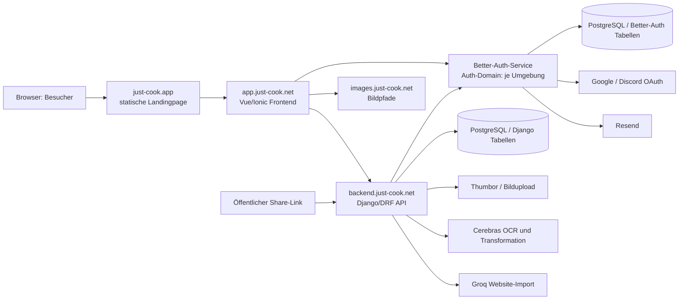

# Ist-Analyse der vier Just-Cook-Repositories

| Feld | Wert |
|---|---|
| Status | `IST`, statische Analyse |
| Prüfdatum | 2026-09-02 |
| Änderungsumfang | Keine Änderungen an den vier Quell-Repositories |
| Secret-Behandlung | Werte absichtlich nicht übernommen |
| Teststatus | Kein vollständiger Build, kein Deployment und kein End-to-End-Test ausgeführt |

## 1. Gesamtbild



Die Grafik ist eine fachliche Systemgrenze, keine Aussage darüber, dass alle
gezeigten Komponenten dieselbe Datenbank oder dieselbe Produktionsumgebung
verwenden. Genau diese Punkte müssen in der Environment- und Datenmatrix
verbindlich geklärt werden.

## 2. Repository-Inventar

| Repository | Aktuelle technische Rolle | Laufzeit / Port | Zustand der vorhandenen Dokumentation |
|---|---|---|---|
| `Just_Cook_Index` | Statische HTML-Seite, Legal-Loader, 404, Nginx | Nginx HTTP 80; Compose `8080:80` | Keine README, keine Tests, keine CI |
| `Just_Cook_Frontend` | Vue 3, Ionic Vue, Vue Router, Capacitor, PWA, Request- und Service-Layer | Vite; Docker Nginx HTTP 80; Compose Hostport 81 | Sechs Markdown-Dateien, mehrere veraltet oder beschädigt |
| `Just_Cook_Backend` | Django, Django REST Framework, Rezept-/Kategorie-/Share-API, KI- und Bildintegration | Gunicorn HTTP 8000; Compose-Datei ohne sichtbare Servicekonfiguration | README leer; vorhandene MkDocs-Seiten teilweise falsch oder historisch |
| `Just_Cook_Auth` | Express-Adapter für Better Auth, E-Mail/OAuth/JWT/JWKS | HTTP 8005 | Keine README, Tests, Migrationen oder CI |

## 3. Verantwortungsgrenzen

### 3.1 `Just_Cook_Index`

`index.html` ist eine monolithische statische Marketingseite. Sie enthält
Inline-CSS, Inline-JavaScript, SEO-Metadaten, Produkttexte, Preis- und
Creditangaben sowie lokale Bildassets. Die eigene JavaScript-Logik steuert nur
mobile Navigation, Vorher-/Nachher-Regler, Credit-Popovers und die Jahreszahl.

Die Website besitzt keine eigene Authentifizierung, keine API, keine
Rezeptdatenbank und keine Benutzerinteraktion mit dem Produktbackend. Die
Anmelde- und Registrierungslinks führen auf `app.just-cook.net`.

Die Legal-Seite lädt Impressum, Datenschutz, AGB und Widerruf zur Laufzeit
über ein externes Script und externe HTML-Quellen. Nginx stellt statische
Dateien bereit, leitet `/impressum` und `/datenschutz` auf Fragmente von
`/legal` um und verwendet eine interne 404-Seite.

Primäre Quellen:

- `Just_Cook_Index/index.html:12-24,374-384,404-418,477-575,577-640`
- `Just_Cook_Index/legal.html:89-125`
- `Just_Cook_Index/nginx.conf:1-30`
- `Just_Cook_Index/Dockerfile:1-8`
- `Just_Cook_Index/compose.yml:1-6`

### 3.2 `Just_Cook_Frontend`

Das Frontend ist eine Vue-/Ionic-SPA mit Lazy-Routen. Es verwendet keinen
formalen Pinia- oder Vuex-Store. `recipes_service` und `categories_service`
sind globale Klasseninstanzen mit CustomEvent-basierter Aktualisierung.

Der Router schützt standardmäßig alle Routen außer den ausdrücklich
öffentlichen Auth-, Legal-, Reset-, Verifikations- und 404-Routen. Der
Auth-Client holt Better-Auth-JWTs und speichert sie zusätzlich unter
`just-cook.jwt` in `localStorage`. Der Request-Layer verwendet
`CapacitorHttp` und sendet Bearer-JWTs an das Django-Backend.

Produktseitig vorhanden oder teilweise vorhanden sind:

- E-Mail-/Passwort-Login, Google- und Discord-Login
- Registrierung, E-Mail-Verifikation als Hinweis-Seite und Passwort-Reset
- Rezeptliste, fuzzy Suche, Kategorien und Favoriten
- Rezept erstellen, bearbeiten und löschen
- Bildaufnahme und OCR
- URL-Import über die KI-Funktion des Backends
- öffentliche Rezeptfreigabe
- Timer für Zeitangaben in Zubereitungsschritten
- PWA-Installation und Cache-Reset
- statische Subscription-/Preisvorschau ohne Billing-Durchsetzung

Primäre Quellen:

- `Just_Cook_Frontend/src/router.ts:5-128`
- `Just_Cook_Frontend/src/index.vue:8-35`
- `Just_Cook_Frontend/src/lib/auth-client.ts:1-69`
- `Just_Cook_Frontend/src/public/ts/requests/*.ts`
- `Just_Cook_Frontend/src/public/ts/services/*.ts`
- `Just_Cook_Frontend/src/routes/*.vue`

### 3.3 `Just_Cook_Backend`

Das Backend bindet seine API unter `/api/` und den Django-Admin unter
`/admin/` ein. Die API nutzt einen Bearer-JWT aus Better Auth; die
Benutzer-ID wird aus `id` oder `sub` gelesen und als String in Rezepten,
Kategorien und Shares gespeichert.

Die Modelle sind nicht relational mit Better-Auth-Benutzern verbunden:

- `Recipe`: `user`, `title`, `body`, `image`, `categories`
- `Category`: `owner`, `category`
- `RecipeShare`: Snapshot aus Secret, Benutzer, Titel, Body und Bild

Das Backend bietet Rezept-CRUD, Kategorienverwaltung, OCR, OCR-zu-Rezept,
Website-Import und öffentliches Sharing. Bilduploads gehen an Thumbor; OCR
und Texttransformation werden über Cerebras ausgeführt, Website-Import über
Groq mit aktiviertem `visit_website`-Tool.

Primäre Quellen:

- `Just_Cook_Backend/src/main/urls.py:17-23`
- `Just_Cook_Backend/src/api/urls.py:1-27`
- `Just_Cook_Backend/src/api/view_recipe/models.py:4-33`
- `Just_Cook_Backend/src/api/view_category/models.py:4-10`
- `Just_Cook_Backend/src/api/util/user/token_manager.py:11-61`
- `Just_Cook_Backend/src/api/util/ai/image_to_recipe.py:15-214`
- `Just_Cook_Backend/src/api/util/ai/web_to_recipe.py:5-28`

### 3.4 `Just_Cook_Auth`

Der Auth-Service mountet Better Auth unter `/api/auth/{*any}`. Better Auth
verwaltet E-Mail-/Passwort-Konten, Verifikation, Passwort-Reset, Google,
Discord, Sessions und JWT/JWKS. PostgreSQL wird über `DATABASE_URL` genutzt;
E-Mails werden über Resend verschickt.

Der Service hört fest auf Port 8005. Die Origins werden aus
`TRUSTED_ORIGINS` gelesen und gleichzeitig für Better Auth und Express-CORS
verwendet. Cookies sind mit `sameSite: "none"` und `secure: true`
konfiguriert.

Es gibt keinen sichtbaren Migrationsschritt, keinen Healthcheck, keine Tests,
keine Startskripte und keine Runtime-Validierung der Pflichtvariablen.

Primäre Quellen:

- `Just_Cook_Auth/src/main.mjs:6-20`
- `Just_Cook_Auth/src/lib/auth.mjs:9-89`
- `Just_Cook_Auth/.env.example:1-15`
- `Just_Cook_Auth/Dockerfile:1-14`
- `Just_Cook_Auth/compose.yml:1-13`

## 4. Tatsächliche End-to-End-Flows

### 4.1 Registrierung und Authentifizierung

1. Das Frontend ruft Better Auth über `authClient.signUp.email` oder
   `authClient.signIn.social` auf.
2. Better Auth legt bei E-Mail/Passwort Benutzer und Account in PostgreSQL an.
3. Für E-Mail/Passwort ist Verifikation verpflichtend; Resend verschickt den
   Link.
4. Nach Verifikation kann Better Auth eine Session erzeugen.
5. Das Frontend ruft `/api/auth/token` auf und speichert das JWT zusätzlich
   lokal.
6. Das Frontend sendet `Authorization: Bearer <JWT>` an die Django-API.
7. Das Backend holt beziehungsweise nutzt JWKS von
   `<BETTER_AUTH_URL>/api/auth/jwks` und filtert Domänendaten anhand der
   Benutzer-ID.

Wichtige aktuelle Abweichungen:

- Das Frontend importiert `@/env`, aber `src/env.ts` ist im untersuchten Baum
  nicht vorhanden.
- Die Registrierung navigiert trotz verpflichtender E-Mail-Verifikation
  direkt nach `/recipes`.
- Der Backend-JWT-Validator prüft weder festen Algorithmus noch Issuer oder
  Audience.
- Logout entfernt den lokalen JWT, widerruft aber bereits ausgestellte
  stateless JWTs nicht sofort.

### 4.2 Rezept und Kategorien

1. Die Vue-Seite ruft einen Request aus `src/public/ts/requests` auf.
2. Der Request erzeugt Auth-Header und verwendet `CapacitorHttp`.
3. Das Backend authentifiziert die Anfrage und filtert auf die Benutzer-ID.
4. `Recipe.body` wird als JSON-String mit `recipe_title`, `ingredients` und
   `instructions` transportiert.
5. `Recipe.categories` wird als kommaseparierter String transportiert und im
   Frontend in `number[]` umgewandelt.
6. Bilder werden als Base64 gesendet oder als Thumbor-/S3-Pfad gespeichert.

Die technische Datenform ist zwischen Liste und Einzelrezept nicht konsistent:
Die Liste verwendet `body` und `categories`; `getRecipe()` im Frontend liest
`recipemd` und `category`, die das aktuelle Backend nicht liefert.

### 4.3 OCR und Website-Import

Beim Bildscan sendet das Frontend Base64 an `/api/getocrtext/`. Das Backend
lädt das Bild zu Thumbor und sendet es zusätzlich als Data-URL an Cerebras.
Die OCR-Antwort wird unter `ocrtext` als String verpackt. Das Frontend parst
darin JSON.

Beim Website-Import sendet das Frontend eine syntaktisch geprüfte URL an
`/api/webtorecipe/`. Das Backend verwendet Groq mit Website-Tool und gibt
ebenfalls ein Feld `ocrtext` zurück. Die Anwendung kennt dabei keinen
erkennbaren serverseitigen SSRF-Schutz oder ein verbindliches Domain-
Allowlist-Konzept.

Der OCR-Prompt und die Antwortverträge sind nicht durchgehend konsistent:
Das aktuelle Cerebras-Schema kennt JSON-Felder `recipe_title`, `ingredients`
und `instructions`, der Transformationsprompt fordert jedoch XML-Tags.

### 4.4 Sharing

1. Das Frontend ruft `POST /api/sharerecipe/` mit einer Rezept-ID auf.
2. Das Backend erzeugt ein zufälliges Secret und speichert einen Snapshot.
3. Das Frontend baut daraus eine öffentliche Share-URL.
4. Eine öffentliche HTML-Seite lädt danach die Rezeptdaten über
   `/api/getsharerecipe/data/?secret=...`.

Der Share-Snapshot hat aktuell keine erkennbare Ablaufzeit, kein Widerrufs-
flag, keine relationale Verbindung zum Ursprungsrezept und keinen sichtbaren
Delete-Endpoint.

### 4.5 Landingpage und Legal

Die Landingpage fordert keine Authentifizierung an und speichert keine
Benutzerdaten. Sie verlinkt auf die App-Domain. Die Legal-Seite wird durch
externen JavaScript- und HTML-Inhalt vervollständigt. Nginx terminiert weder
TLS noch stellt es den Auth- oder API-Proxy dar.

### 4.6 Landingpage: Routing, SEO und externe Inhalte

Die Index-Website stellt `/`, `/index` und `/index.html` sowie `/legal` und
`/legal.html` über Nginx bereit. `/impressum` und `/datenschutz` werden mit
HTTP 302 auf Fragmente von `/legal` umgeleitet; unbekannte Pfade landen auf
der internen `/404.html`. Bestimmte Assets werden ein Jahr mit `immutable`
gecacht, obwohl die Dateinamen nicht generell content-hash-basiert sind.

Die Landingpage enthält Canonical-, Open-Graph-, Twitter- und JSON-LD-Daten,
aber kein `robots.txt`, keine Sitemap und kein definiertes Social-Preview-Bild.
Die Legal-Seite ist `index,follow`, lädt ihre vier Texte aber erst über ein
externes Script und externe HTML-Quellen. Die vollständige Rechtstext-
Darstellung hängt daher von Drittanbieter-JavaScript, Cross-Origin-Fetch und
der Verfügbarkeit des Legal-Providers ab.

Primäre Quellen:

- `Just_Cook_Index/nginx.conf:8-29`
- `Just_Cook_Index/index.html:12-24,374-384,404-418,569-640`
- `Just_Cook_Index/legal.html:89-125`
- `Just_Cook_Index/fav/site.webmanifest:1-21`

## 5. Aktuelle Datenverträge

### Rezeptkörper

Der im Frontend erwartete und gespeicherte Rezeptkörper ist:

```json
{
  "recipe_title": "Pasta",
  "ingredients": ["200 g Nudeln"],
  "instructions": ["Nudeln kochen"]
}
```

Er wird als String im Feld `body` gespeichert. Das Backend validiert den
inneren JSON-Aufbau nicht.

### Kategorien

Backend und Frontend transformieren:

```text
Backend:  "1,4,7,-1"
Frontend: [1, 4, 7, -1]
```

Die Frontend-Sonderwerte sind derzeit `-1` für Favoriten, `-2` für alle
Rezepte und `-3` für keine Auswahl. `-2` wird beim Anlegen eines Rezepts als
technischer Wert ergänzt. Diese Semantik ist noch kein sauberer Backend-
Domänenvertrag.

### Bild

Neue Bilder werden als Base64 ohne Data-URL-Präfix gesendet. Der Backend-
Upload liefert typischerweise einen relativen Thumbor-Pfad; das Frontend
setzt `S3_URL` davor. Ein führender Slash kann zu doppelten Slashes führen.

## 6. Dokumentations- und Betriebsrisiken

| Priorität | Befund | Quellen |
|---|---|---|
| P0 | Echte Secrets beziehungsweise Tokens liegen in Arbeitsständen, Code, `.env` oder historischer Dokumentation | Backend `settings.py`, Backend `image_to_recipe.py`, Backend Legacy-Doku, Auth `.env` und Git-Historie |
| P0 | Backend-JWT-Prüfung übernimmt Algorithmus aus dem ungeprüften Header und prüft Issuer/Audience nicht | `Just_Cook_Backend/src/api/util/user/token_manager.py:18-35` |
| P0 | Frontend-Rezeptcache `just-cook.recipes` ist nicht benutzerbezogen und wird beim Logout nicht gelöscht | `Just_Cook_Frontend/src/public/ts/services/recipes.service.ts:6-24`, `routes/settings.vue` |
| P1 | `src/env.ts` fehlt trotz Import; Frontend-Build und `VITE_SHARE_URL` sind unklar | `Just_Cook_Frontend/src/lib/auth-client.ts:3`, `requests/base.request.ts:2`, `.env.example` |
| P1 | Auth-Schema/Migrationen und Startreihenfolge sind nicht dokumentiert oder automatisiert | `Just_Cook_Auth/src/lib/auth.mjs:86-89`, `Dockerfile`, `compose.yml` |
| P1 | Frontend und Backend haben widersprüchliche Einzelrezept-, Kategorie- und KI-Response-Verträge | Frontend `recipe.request.ts`, `categories.service.ts`; Backend Views/Serializer |
| P1 | Backend-Dockerfile kopiert mit `COPY . .` auch `.env` und Legacy-Dokumentation in den Buildkontext | Backend `Dockerfile:13-21`, `.dockerignore` |
| P1 | Frontend-Dockerfile verwendet Bun und `--frozen-lockfile`, im Repository liegt aber kein `bun.lock` | Frontend `Dockerfile:1-13`, `package.json`, `package-lock.json` |
| P1 | Preis-, Credit- und Sharing-Aussagen der Landingpage werden in der App nicht technisch durchgesetzt | Index `index.html:532-559`, Frontend `subscribe.vue`, `recipe.vue` |
| P2 | Öffentliche Shares haben keine sichtbare TTL oder Widerrufsroute | Backend `models.py`, `views.py:195-266` |
| P2 | URL-Import und KI-/Bildpayloads haben keine belastbaren Größen-, Timeout-, Rate- oder SSRF-Regeln | Backend `web_to_recipe.py`, `image_to_recipe.py`, Serializer |
| P2 | Tests, CI, Healthchecks, Monitoring, Backup/Restore und Rollback fehlen oder sind unvollständig | alle vier Repositories |

## 7. Vorhandene Dokumentationsqualität

Die vorhandenen Dokumente sind keine verlässliche zentrale Quelle:

- Backend `README.md` ist leer.
- Backend `Introduction.md` verwendet falsche Pfade, `requirements.txt.bak`,
  `runsever` und einen alten Port.
- Backend `Important Classes.md` beschreibt alte lokale Authentifizierung,
  HS256, `CustomUser`, alte KI und alte Dateipfade; sie enthält außerdem
  sensible historische Beispiele.
- Frontend `architecture.md` ist beschädigt und nennt nicht vorhandene
  Verzeichnisse und Services.
- Frontend `refactor.md` und `api-standardization-plan.md` sind Pläne aus
  einer früheren Architektur, keine aktuelle Verträge.
- Frontend `coding-style.md` enthält veraltete Pfade, Farben und Auth-
  Beispiele.
- Frontend `better-auth-sso.md` ist die brauchbarste Ausgangsquelle, deckt
  aber Token-Speicherung, konkrete Flows und Testmatrix nicht vollständig ab.
- Index besitzt keine README, keinen Testplan und keine Deploymentdokumentation.

## 8. Offene Tatsachenfragen

Vor der Freigabe einer `SOLL`-Dokumentation müssen mindestens folgende Punkte
belegt oder entschieden werden:

- Welche Frontend-, Backend- und Auth-Domain ist pro Umgebung kanonisch?
- Zeigen Auth-Service und Django-Backend auf dieselbe Datenbankinstanz und
  welche Rollen dürfen welche Tabellen sehen?
- Wer generiert, versioniert und rollt Better-Auth-Migrationen aus?
- Ist JSON oder XML das verbindliche KI- und Rezeptformat?
- Sind `body` und `categories` die alleinigen aktuellen API-Felder?
- Wie werden JWT-Algorithmus, Issuer, Audience, TTL und Revocation festgelegt?
- Wie werden Accounts, Social-Login-Verifikation und AGB-Zustimmung behandelt?
- Welche Lebensdauer und Widerrufssemantik haben Share-Secrets?
- Sind Tarife, Credits, Billing und Entitlements implementiert oder nur geplant?
- Wird die Anwendung als PWA, native Android-App, iOS-App oder nur als Web-App betrieben?
- Welche Dependency-Quelle und welche Python-, Node- und Bun-Versionen sind verbindlich?
