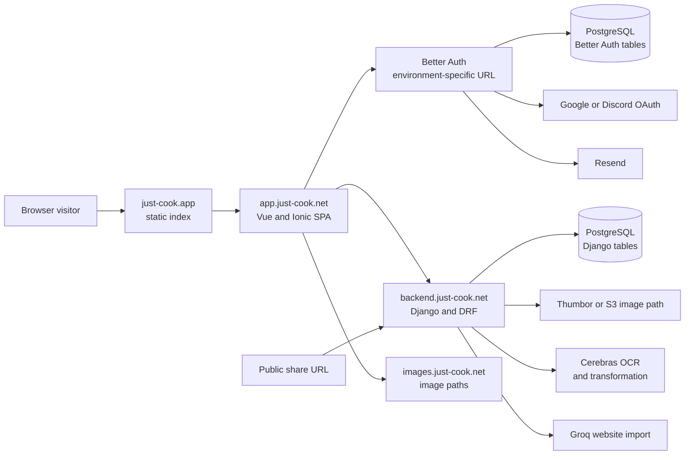

# System Architecture

| Field | Value |
|---|---|
| Status | `CURRENT` with `OPEN` environment boundaries |
| Last reviewed | 2026-09-02 |
| Sources | [`Just_Cook_Backend/src/main/urls.py`](../../../Just_Cook_Backend/src/main/urls.py); [`Just_Cook_Auth/src/main.mjs`](../../../Just_Cook_Auth/src/main.mjs); [`Just_Cook_Frontend/src/public/ts/requests/base.request.ts`](../../../Just_Cook_Frontend/src/public/ts/requests/base.request.ts) |

## Purpose

This page shows the conceptual request flow without implying that all services
share a database, host, or production environment.

## Current architecture

The browser is the main integration point. The frontend obtains a Better Auth
JWT, stores a local copy under `just-cook.jwt`, and sends it as a bearer token
to protected Django endpoints. The API is mounted below `/api/`; Django admin
is mounted below `/admin/`.

Authentication and domain persistence are conceptually separate. Better Auth
uses PostgreSQL for its own tables. Django stores the Better Auth user ID as a
string in `Recipe`, `Category`, and `RecipeShare`. No foreign-key relationship
to a Better Auth user is visible in the reviewed models.

## Main flows

1. A visitor enters through the public index and follows a login or app link.
2. The frontend uses Better Auth for email/password, verification, reset, or
   social authentication.
3. The frontend requests a JWT and calls the backend with
   `Authorization: Bearer <token>`.
4. The backend filters recipes and categories by the JWT user ID.
5. Recipe images and AI operations cross the backend boundary to the configured
   external providers.
6. Sharing creates a snapshot and exposes it through a public secret-based URL.

## Open boundaries

- `OPEN`: whether the Auth and Django services use the same PostgreSQL instance
  and which database roles can access which tables.
- `OPEN`: the canonical auth URL in each environment and the complete CORS
  origin matrix.
- `OPEN`: the ownership, lifecycle, and operational limits for Thumbor,
  Cerebras, and Groq integrations.
- `OPEN`: JWT issuer, audience, algorithm, lifetime, and revocation policy.

## Further reading

- [Authentication flow](../03-auth/authentication-flow.md)
- [Backend overview](../04-backend/overview.md)
- [Deployment](../08-deployment/deployment.md)
- [Troubleshooting](../02-getting-started/troubleshooting.md)

## Change history

| Date | Change |
|---|---|
| 2026-09-02 | Initial English architecture description and Mermaid diagram |
