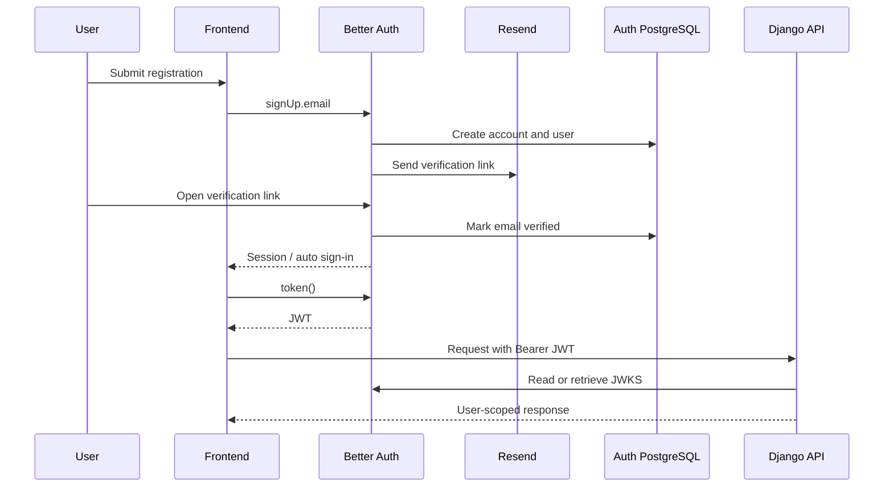

# Authentication Flow

| Field | Value |
|---|---|
| Status | `CURRENT` with `OPEN` contract and security decisions |
| Last reviewed | 2026-09-02 |
| Sources | [`Just_Cook_Frontend/src/lib/auth-client.ts`](../../../Just_Cook_Frontend/src/lib/auth-client.ts); [`Just_Cook_Frontend/src/router.ts`](../../../Just_Cook_Frontend/src/router.ts); [`Just_Cook_Auth/src/lib/auth.mjs`](../../../Just_Cook_Auth/src/lib/auth.mjs); [`Just_Cook_Backend/src/api/util/user/token_manager.py`](../../../Just_Cook_Backend/src/api/util/user/token_manager.py) |

## Purpose

This page describes how a browser session becomes a bearer-authenticated API
request and records the current deviations that developers must account for.

## Email/password flow

The source configuration requires email verification and enables automatic
sign-in after successful verification. The frontend's registration route was
observed to navigate directly to `/recipes`, so the user-visible behavior is
not fully aligned with the Auth requirement.

## Social sign-in

The frontend calls Better Auth social sign-in for Google or Discord. The Auth
service has both providers configured from environment variables and disables
implicit sign-up for each. The exact provider callback URLs and the handling of
an account that does not yet exist are `OPEN`.

## Token acquisition and storage

1. The router permits the public auth routes without a session.
2. Protected routes call `authClient.getSession()`.
3. If a session exists, the frontend calls `authClient.token()`.
4. The token is stored in `localStorage` as `just-cook.jwt`.
5. API requests call `createAuthHeaders()` and send
   `Authorization: Bearer <token>`.
6. If the session lookup fails, the router can still accept a stored token.

The local token is a convenience for PWA/browser continuity, not a revocation
mechanism. Clearing it on logout does not immediately invalidate an already
issued stateless JWT.

## Password reset and email verification

Better Auth sends both reset and verification links through Resend. The
frontend has `/reset`, `/reset-password`, and `/verify-email` routes. Email
delivery fails when the Resend key or sender identity is not configured.

## Current deviations and risks

- `OPEN`: the frontend imports `@/env`, but the analyzed tree does not contain
  `src/env.ts`.
- The Backend validator accepts the algorithm from the unchecked JWT header and
  does not visibly enforce issuer or audience.
- Registration can route to recipes before the required email verification is
  confirmed.
- Logout removes the local copy but does not provide immediate server-side
  revocation for stateless JWTs.
- `OPEN`: token lifetime and refresh behavior are not defined in the accepted
  analysis.

## Further reading

- [Authentication overview](overview.md)
- [Auth endpoint reference](../07-api/endpoints/auth.md)
- [Troubleshooting](../02-getting-started/troubleshooting.md)
- [Routes and state](../05-frontend/routes-and-state.md)

## Change history

| Date | Change |
|---|---|
| 2026-09-02 | Initial sequence and browser-flow documentation |
